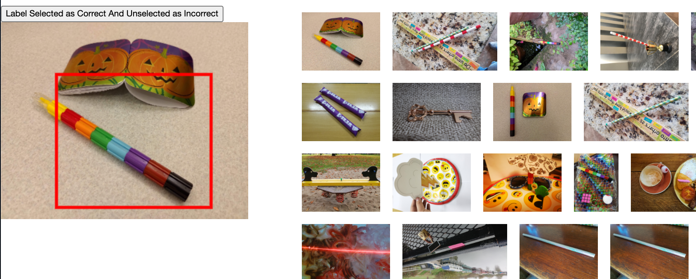
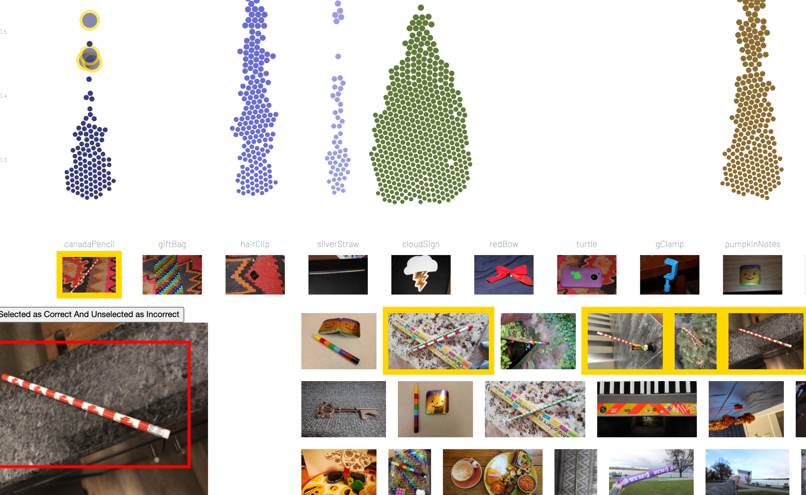

# Beeswarm chart for question 1

This interface uses interactive beeswarm chart to support visual analytics for question 1.

## Help youself adding data
The folder `MC2-Image-Data` is too huge to be added into this repo. Please copy and paste it to under `q1`

## How to interpret the chart

There are 43 different objects (or, 43 labels, 43 classes, you name it. Anyway, these words will be used interchangably in this readme doc). For each label, a beeswarm chart is drawn to show how well that class has been classified. Each dot in a beeswarm chart represents an image that contains the object being classified as the class that the beeswarm chart corresponds to. Such classification may or may not be correct. The dots are laid out horitonally according to their label and vertically according to their `Score`s, which quantify how confident the classifier is to the fact that the sample is of the class.

## What you need to do with this interface

Apparently the machine-leanring-based classifier is very very poor at detecting and classifying objects. So those misclassified results need to be corrected. And by contrasting the manually corrected results we can give answers to question 1, 2 and 3. This interface comes to help in the "manuanlly correcting" process.

## How to use

1. Click a label image at the bottom, under the label text, to display all images classified as the label.

2. Among the displayed images, left click to select an image, reclick to deselect. You can select as many images as you want. When an image is selected, its border turns yellow.

3. Right click to tag images as 'correctly classified', 'misclassified' or relabel them. There are actually two process you might follow. You can first filter out all the misclassified images, and then relabel them. Or you can relabel a bunch of images directly. That way you basically skip the step of tagging them as misclassified.

4. When you hit `relabel` when right clicking, a window with a dropdown pops up and you need to click the drop down to select the new label for all the images you just selected. The relabeled images immediately disappears from the bottom images

5. When you tag a bottom images as 'correctly classified', its border turns green and so does the border of the related dot in the beeswarm chart. If it is tagged as 'misclassified', both the border of the image and the border of the corresponding scatter turn red.

6. When you hover on a bottom image, another image with exactly the same content of the hovered one is shown above. In this new image a boundingbox given by the classifier, is visualized.

## Some illustrations

1. 
2. 
3. 
4. 
4. 