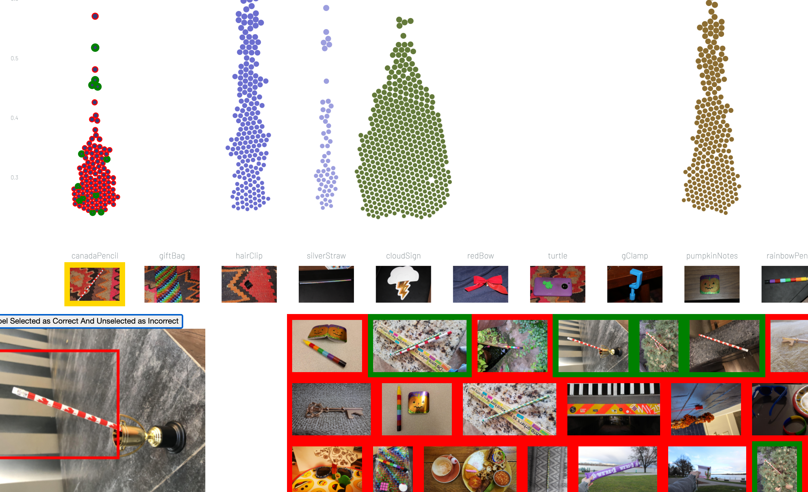

# Beeswarm chart for question 1

This interface uses interactive beeswarm chart to support visual analytics for question 1.

## Help youself adding data
The folder `MC2-Image-Data` is too huge to be added into this repo. Please copy and paste it to under `q1`

## How to interpret the chart

There are 43 different objects (or, 43 labels, 43 classes, you name it. Anyway, these words will be used interchangably in this readme doc). For each label, a beeswarm chart is drawn to show how well that class has been classified. Each dot in a beeswarm chart represents an image that contains the object being classified as the class that the beeswarm chart corresponds to. Such classification may or may not be correct. The dots are laid out horitonally according to their label and vertically according to their `Score`s, which quantify how confident the classifier is to the fact that the sample is of the class.

## What you need to do with this interface

When using interface 1, we basically want to check the classfication results. Let's give an exmaple say we want to check how the classifier does on the class `canadaPencil`. We first show all the images that have an object classified as `canadaPencil` and go through them one by one to check if the classification is correct or not. Conducting the verification one at a time could be very much tedious and doesn't leveraging any human visual capacity at all. So interface 1 provides is a group selection function that allows you to select as many images as possible. You check the selected ones as correct and unselected ones will automatically be marked as incorrect. The group selection interaction is a major expansion of your field of view in terms of seeing the image data.

## How to use

1. Click a label image at the bottom, under the label text, to display all images classified as the label.

2. Among the displayed images, left click to select an image, reclick to deselect. You can select as many images as you want. When an image is selected, its border turns yellow.

3. Select all the images you think containing the object and hit the button `label selected as correct and unselected as incorrect`

## Very Important Information

The verification process could be tiring. So anytime you don't feel like continuing, just hit the `download new result` button on top. That saves the result you've gotten so far in a file named `new_data.json`. Next time you wanna start from the latest break point just put the saved data in this folder and modify the `json_path` in script `beeswarm_chart.js` as `new_data.json`.

## An Illustration

Let's take the verification for class `canadaPencil` as an example. We first click the image of `canadaPencil`. Upon the click, the image will be bordered in gold. And we see images appear on the bottom view. Those images are images the classifier says to have `canadaPencil`.

Now if you hover on one of those image, a magnified view of that image will show on your left with bounding boxes drawn. With the maginifed image you can see clearly if the object inside the bounding box is the target object or not. The one shown as follows is a misclassified class as the object in the bounding box is `rainbowPencil` instead of `canadaPencil`.

We move on to select all images that do have a `canadaPencil` within. To see all the images you might need to scroll down as they are so many. Whenever an images is selected, it gets a gold border and the corresponding data point in the beeswarm chart gets highlighted.

Now that we have selected all `correctly classified` cases. We can hit the butoon `Label Selected as Correct and Unselected as Incorrect` to mark samples as `correct` or `incorrect`.

That's what we have after hitting the button. Looks like the classfier does pretty poorly on recognizing `canadaPencil`. And that's the entire process of verification for `canadaPencil`. Go on and verify other classes. You got 42 more to get done!
